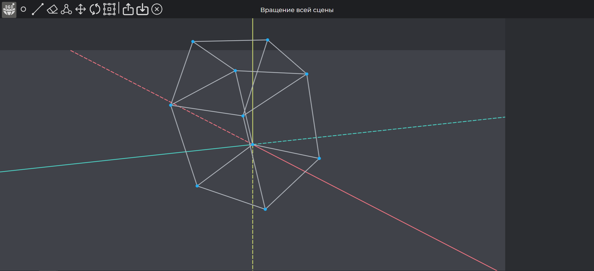

# Графический редактор

* [О проекте](#AboutProject)
* [Используемые технологии](#TechnologiesUsed)
* [Как запустить проект (Windows)](#StartProject)

## О проекте

Перефразируй и расширь текст

Web-приложение представляет собой графический редактор, разработанный для 3D проектирования. Редактор позволяет добавлять и удалять точки и линии. Точки можно добавлять в группу, группу можно перемещать, вращать и трансформировать. Получившиеся модели можно сохранять в файл.
  

## Используемые технологии

Проект был разработан на операционной системе Windows 11. На языке программирования Java Script. В проекте использовалась библиотека React (команда для установки "npx create-react-app GraphicEditor3D"). Для рисования дополнительно загружена библиотека Konva (команда для установки "npm install react-konva konva --save")

## Как запустить проект (Windows)

1. Установить Node JS (https://nodejs.org/)
2. Скачать проект с Git Hub
3. В консоли зайти в папку GraphicEditor3D (в ней лежат файлы package.json и package-lock.json)
4. В консоль ввести команду "npm i" для установки библиотек
5. В консоли ввести команду "npm start" для запуска проекта

